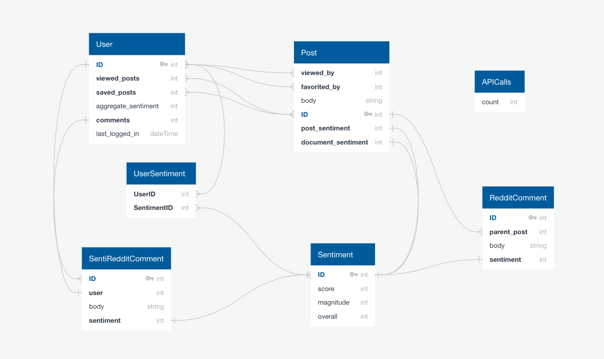

# PROJECT 4 - SENTIREDDIT 

By [Kianna Love](https://github.com/akirakianna) and [Alex Nicholas](https://github.com/alicnik)

PAIR PROGRAMMED THROUGHOUT

MATERIAL UI IMPORTS USING DEFAULT INSTEAD OF NAMED, BETTER PERFORMANCE ACCORDING TO DOCS

## Overview

For this project I worked **collaboratively** in a pair. We were asked to build a full stack application utilising the backend technologies recently learned in class. It was to be completed within one week.
I worked collaboratively to create a full-stack web application within 8 days, utilising a Python Flask RESTful API. We pair programmed throughout, using the driver navigator relationship. 

## Table of Contents

## Project Brief

* **Build a full-stack application** by making your own backend and your own front-end.
* **Use a Python Flask API** using a Flask REST Framework to serve your data from a Postgres database.
* **Consume your API with a separate front-end** built with React.
* **Be a complete product** which most likely means multiple relationships and CRUD functionality for at least a couple of models.
* **Implement thoughtful user stories/wireframes** that are significant enough to help you know which features are core MVP and which you can cut.
* **Have a visually impressive design** to kick your portfolio up a notch and have something to wow future clients & employers. **ALLOW** time for this.
* **Be deployed online** so it's publicly accessible.

## Technologies Used

* HTML
* CSS in JS
* React.js
* Moment.js
* Python
* Flask
* Google Natural Language API
* Reddit API
* PRAW
* Marshmallow
* PostgreSQL
* SQLAlchemy
* Material UI
* React Hook Forms
* Yup
* TablePlus
* Git and GitHub
* Styled Components

## Approach

### Planning / Thought Process

#### Models (diagram)

We used ___ to plan/draw out our model relationships - entity relationships? Please see our models section for ...

#### Wireframes

We designed our app mobile first so drew up our wireframes with this in mind:

### Backend

#### Models

Talk about relationships in here

#### API Endpoints

### Frontend

#### UseContext

a way of passing props around your app without having to pass them through every component
props.children placeholder for the components that will be insdie of the provider.
it is unertain at that first point - you don't know what children is at that point
custom provider - all user context logic can live in file. create custom provider what it returns is the user context provider because 
by building the custom provider you can keep all of your usercontext logic in the userContext component.. in that file (keep it separate from app.js) ... don't hvae to list all of your values in app.js as you state the file in the custom provider in the user context file - much more readable.

props is an umbrella term for all the properties a component has - every component has props. when you call a component... state would be current something set current something, when that make api call and set the post as the post in state - the response will have all of the posts details... this will all be in state.

A prop is passing information (e.g variables, functions, state etc..) from a parent component to a child component. Our parent will be the main post page (post and comments) and in it will call the reddit post component sentireddit comment and redditcomment - these components will know what they have to do from props. One API call in the parent and pass the relevant parts to the children.

? Decided to include emoiton on the backend to limit the amount of API calls on the front end, makes more sense to include it with we calculate our aggragate sentiment .... as that what it ties on with always have an emoition from aggregate sentiment.

## Challenges
1 - Google Cloud language library would not load on my laptop, couldn't work out  a solution decided to build the request instead of using the libray in case when deployed no one could access the sentiments ...?
2. Deployment Cors wouldn't allow reddit api to make requests to the browser heroku couldn't make requests to reddit api directly... fixed by moving routes in to the backend and the requests to the reddit api from there using PRAW...originally in home.js now in home controller

## Victories

## Future Features

## Credit

