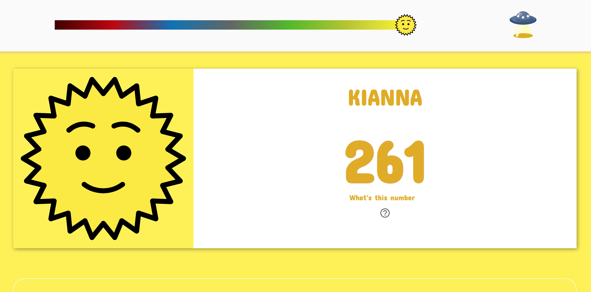
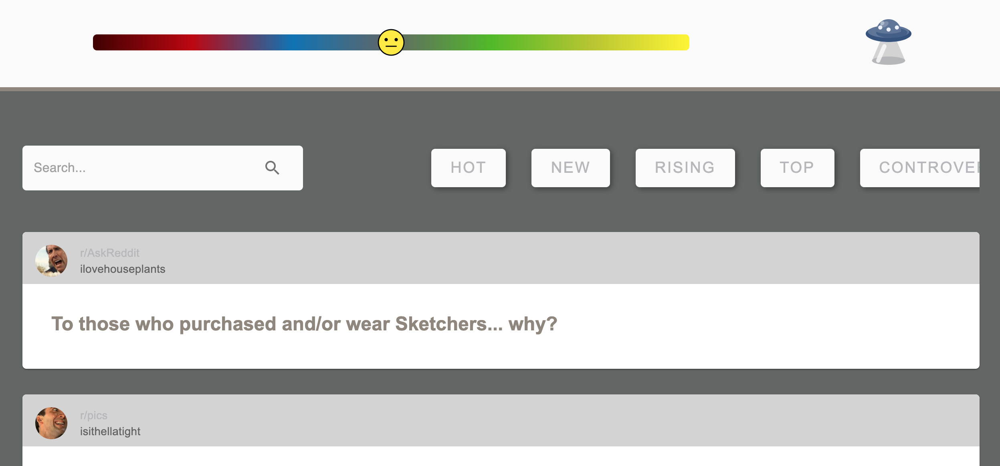
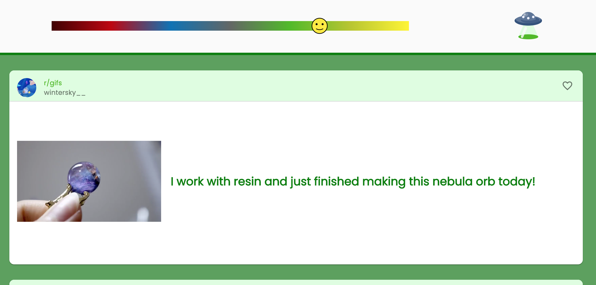
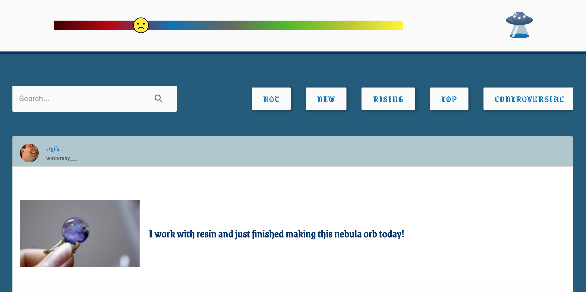
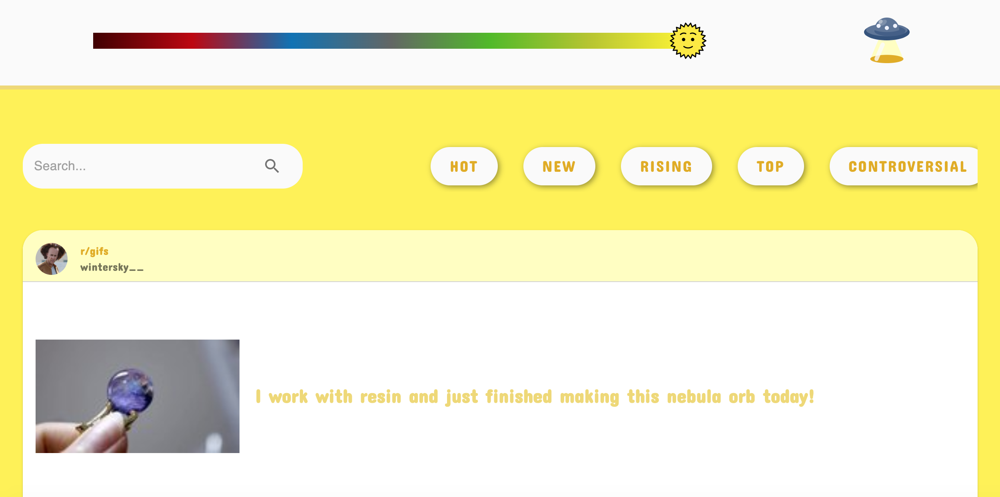
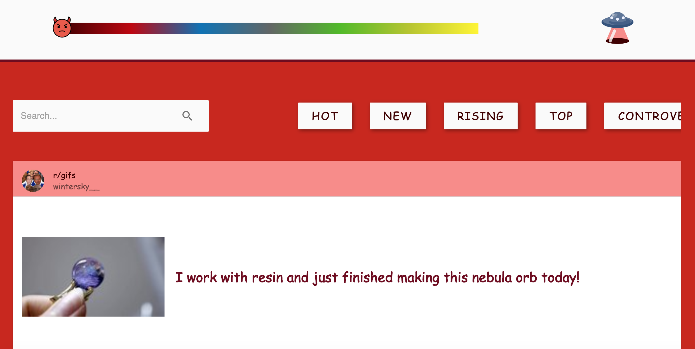

# PROJECT 4 - SentiRed

By [Kianna Love](https://github.com/akirakianna) and [Alex Nicholas](https://github.com/alicnik)

## Overview

For my final project at GA, I **worked collaboratively** to create a **full-stack web application** within **8 days** which utilises a Python Flask RESTful API. We pair programmed throughout, using the driver navigator relationship. 

SentiRed is an application which uses machine learning/natural language analysis to track a user's sentiment score based on what they are reading and creates a dynamic Emotional UI from this.

[REWORD] Our final concept came from an amalgamation of our ideas. I had been researching Emotional UI and was keen to incorporate it. Alex wanted to implement the Google Cloud Natural Language API, as he had been reasearching news algorithms and how they trigger an emotional response.

You can find our project online [here](https://senti-red.herokuapp.com/#/).

## Table of Contents

1. [Brief](#Project-Brief)
2. [Technologies used](#Technologies-Used)
3. [Approach](#Approach)
    - [Planning](#Planning-/-Thought-Process)
    - [Back-end](#Back-end)
    - [Front-end](#Front-end)
- [Challenges](#Challenges)
- [Victories](#Victories)
- [Lessons Learned](#Lessons-Learned)
- [Future Improvements](#Future-Features-and-Improvements)
- [Credit](#Credit) 

## Project Brief

* **Build a full-stack application** by making your own back-end and your own front-end.
* **Use a Python Flask API** using a Flask REST Framework to serve your data from a Postgres database.
* **Consume your API with a separate front-end** built with React.
* **Be a complete product** - multiple relationships and CRUD functionality for at least a couple of models.
* **Implement thoughtful user stories/wireframes**.
* **Have a visually impressive design**.
* **Be deployed online** so it's publicly accessible.

## Technologies Used

* HTML
* CSS in JS (styled components)
* React.js
* Moment.js
* Python
* Flask
* Marshmallow
* PostgreSQL
* SQLAlchemy
* Google Natural Language API
* Reddit API
* PRAW
* Material UI
* React Hook Forms
* Yup
* TablePlus
* Insomnia
* Git and GitHub


## Approach

### Planning / Thought Process

#### MVP

We initially spent some time discussing our idea and how best to approach the build. We created a shared Google Doc to create an outline:

- User must register an account to use our app.
- Home page will be similar to Reddit's, as it will return current trending Reddit posts - option to *toggle* between the main categories (Hot, New, Rising, Controversial, Best, Random).
- A single post page, which will return the full Reddit post, plus its associated comments from Reddit.
- Use Google's Natural Language API to measure the sentiment of the language in both posts and comments and push that analysis to the user's overall score.
- Have our UI change based on the user's sentiment score.
    - Change background colour, fonts.
    - Have a sliding scale (progress bar), where the slider moves when a user's sentiment score changes.
    - Possibly use an emoji as the slider which would also change at certain thresholds (😃, 😢, 😡). 
    - Change border radius depending on emotional state, i.e rounded for happy (bubbly), angular (spiky) for angry.
   
- User's will have the option to favourite a post, as well as comment on a post (on the single post page).
- User's will have their own account page, which will include their overall sentiment score, their favourited posts as well as their viewed posts.
- Stretch goals
     - D3 Data Visualisation
     - Animation when certain emotional levels are reached.
     - Reset password link.
     
After we had settled on the general idea for our project, we began by exploring the Reddit API (to see what information we could access and what endpoints we would want to use) and setting up our authorization.
The Reddit API would be returning the main chunk of our app's data, so we wanted to make sure that it worked the way we expected it to.

**Example of endpoint initially used for getting a post and its comments**:

- oauth.reddit.com/comments/{article_id}
     - response[0].data.children[0].selftext 
     - *returns the body of the post.*
     - response[0].data.children[0].title 
     - *returns the title of the post.*
     - response[0].data.children[0].secure_media        
     - *returns the images/video.*

#### Wireframes

We designed our app mobile first using Figma, as it allows you to quickly draft up an MVP of your product:


#### Entity Relationship Diagram

We used Quick DBD to create our entity relationship diagrams (the relationships between our app's models): 


### Back-end

For this project we decided to split up our models and schemas as there was a reported issue with imports (noted [here](https://github.com/marshmallow-code/flask-marshmallow/issues/143)) which pointed out that as Marshmallow schemas instantiate Flask SQLAlchemy models when imported, it can lead to circular references which result in errors. 

#### Models

The relationships between our models were quite complex, so we spent a fair bit of time working them out. Please see diagram [above](#Entity-Relationship-Diagram).

- **Many to many**
      - A post can be viewed or favourited by many users.
      - A user can have many viewed and saved posts.
      - A user can have many sentiments.
      - A sentiment can be stored on many users.
      (User sentiment is a join table, covered [here](#Join-Tables)).
- **One to many**
      - A post can have many Reddit comments.
      - A user can post many comments on the SentiRed app.
- **One to one**
      - A Reddit comment has one sentiment score.
      - A post has one sentiment score.
      - The overall post page has a single sentiment score.
      - A user's comment has one sentiment.
      
From this, we were able to create several models for the PostgreSQL database using Flask-SQLAlchemy.

- Post
- Reddit Comments
- SentiRed Comments
- Sentiment 
- User

*I will explore our User and Sentiment models as examples of our back-end logic.*

By extending SQLAlchemy's exisiting model class, we were able to define our own models by creating a new class instance - e.g. **User**. We then defined its table structure using various data types:

```

class User(db.Model, BaseModel):
    __tablename__ = 'users'

    username = db.Column(db.String(20), nullable=False, unique=True)
    avatar = db.Column(db.Text, nullable=True, default=(random_cage()))
    email = db.Column(db.String(128), nullable=False, unique=True)
    password_hash = db.Column(db.String(128), nullable=True)
    aggregate_sentiment = db.Column(db.Float, default=0)
    last_logged_in = db.Column(db.DateTime, nullable=True, default=datetime.now())
    emotion = db.Column(db.String(50), default="neutral")

    comments = db.relationship('SentiRedditComment', backref='user')
    user_sentiments = db.relationship('Sentiment', secondary=user_sentiments, backref='user')
    viewed_posts = db.relationship('Post', secondary=user_viewed_posts)
    saved_posts = db.relationship('Post', secondary=user_saved_posts)
```

A user's aggregate sentiment score comes from an accumulation of sentiment scores collected as they read posts and comments on our application.

We used the data type Float for this column and gave it a default value of 0, as the Google Natural Language API sentiment analysis returns a float ranging from -inf to +inf.

*To make it more user friendly on the front end, we 
used the following function:*

```
{user.aggregate_sentiment && Math.round(user.aggregate_sentiment * 100)}
```
*Displayed like so:*



We calculated this aggregate sentiment score by writing a reducer function: 

```py
def calculate_user_aggregate_sentiment(user):
    def sentiment_sum(a, b):
        if getattr(a, 'score', None):
            return a.score + b.score
        else:
            return a + b.score
    user.aggregate_sentiment = reduce(sentiment_sum, user.user_sentiments, 0)
    if user.aggregate_sentiment >= 1.5:
        user.emotion = 'ecstatic'
    elif user.aggregate_sentiment > 0.5:
        user.emotion = 'happy'
    elif user.aggregate_sentiment > -0.5:
        user.emotion = 'neutral'
    elif user.aggregate_sentiment <= -1.5:
        user.emotion = 'angry'
    elif user.aggregate_sentiment <= -0.5:
        user.emotion = 'sad'
```


Which reduces all of a user's sentiments that are stored in the user_sentiments join table:

```py
user_sentiments = db.Table(
    'user_sentiments',
    db.Column('user_id', db.Integer, db.ForeignKey('users.id'), primary_key=True),
    db.Column('sentiment_id', db.Integer, db.ForeignKey('sentiments.id'), primary_key=True)
)
```
     
- Back in the user model there are several relationships with secondary keyword arguments, e.g:

     `user_sentiments = db.relationship('Sentiment', secondary=user_sentiments, backref='user')`
     

- These tell SQLAlchemy the specified join table to use to make the relationship work.

The resulting overall sentiment score from the `calculate_user_aggregate_sentiment` function updates the user's "emotion" property, which is then used on the front end for rendering emotional UI. See [Style Context](#Style-Context).


#### Sentiment Model

Our Sentiment model became the primary component in our back-end as it stores the language sentiment analysis returned from the API.

It has 3 main columns: 

- Polarity 
      - Will be a float between -inf and +inf.
- Magnitude  
      - The *amount* of sentiment the analysed language has (e.g if the text has low sentiment it may return 0).
- Score
      - The score is the above values multipled together, a column we created to facilitate our end goal of being able to represent the sentiment in our UI. 


```py
class Sentiment(db.Model, BaseModel):

    __tablename__ = 'sentiments'

    polarity = db.Column(db.Float, nullable=False)
    magnitude = db.Column(db.Float, nullable=False)
    score = db.Column(db.Float, nullable=False)

    sentireddit_comment_id = db.Column(db.Integer, db.ForeignKey('sentireddit_comments.id', ondelete='SET NULL'))
    reddit_comment_id = db.Column(db.Integer, db.ForeignKey('reddit_comments.id'))
    post_id = db.Column(db.Integer, db.ForeignKey('posts.id'))
```
As a user has the option on the front-end to delete any comment they post, we wanted to make sure that the deletion of the comment would not equate to the deletion of the sentiment, as other users may have already interacted with this comment.

The sentiment is a relationship which should persist for accurate calculation of the user's aggregate sentiment. We account for this by setting `ondelete='SET NULL'` on the *sentireddit comment id* column.

It also has 3 additional columns, which we have limited to 
only contain the id of the post/comment to which the sentiment refers.
On the respective tables, we define a sentiment column which links back to the sentiment model - e.g:

```py
class SentiRedditComment(db.Model, BaseModel):

    __tablename__ = 'sentireddit_comments'

    body = db.Column(db.Text, nullable=False)
    user_id = db.Column(db.Integer, db.ForeignKey('users.id'))
    post_id = db.Column(db.Integer, db.ForeignKey('posts.id'))
    
    sentiment = db.relationship(
        'Sentiment',
        uselist=False,
        backref='sentireddit_comment',
        passive_deletes=True
    )
```


#### Restrictions

Due to potential billing costs, we had to try and rate limit the calls made to Google's API. To do so, we created an additional table (ApiCalls) to track all of the analysis calls made.

```py
class ApiCalls(db.Model, BaseModel):
    __tablename__ = 'api_calls'
    count = db.Column(db.Integer)
```

In our Post Controller we use this for rate limiting our analysis:

```
 for comment in post.reddit_comments:
        calls = ApiCalls.query.get(1)
        if calls.count > 4500:
            break
 ```
 
This stops analysis of the comments if the calls made to the API go over 4500.

#### Serialization and Deserialization 

Marshmallow facilitates serialization and deserialization of Python into JSON and vice versa. 

This is useful for working with a React front-end, as it helps us to access our data in a convenient format.

For (most of) our models we created a corresponding schema = e.g **UserSchema**:

```py
class UserSchema(ma.SQLAlchemyAutoSchema, BaseSchema):

    password = fields.String(required=True)
    password_confirmation = fields.String(required=True)
    comments = fields.Nested('SentiRedditCommentSchema', many=True)
    user_sentiments = fields.Nested('SentimentSchema', many=True)
    viewed_posts = fields.Nested('PostSchema', many=True)
    saved_posts = fields.Nested('PostSchema', many=True)

    class Meta:
        model = User
        load_instance = True
        exclude = ('password_hash',)
        load_only = ('password',)
```

Our schemas include nested fields which are a feature of Marshmallow that represent of our table relationships in the JSON response that is used by the front end. 

#### Mixins 

We were able to simplify our models and schemas somewhat by using a *mixin*, as we had a couple of methods and properties that we wanted all of our models/schemas to be able to access:

```py
class BaseModel:
    id = db.Column(db.Integer, primary_key=True)
    created_at = db.Column(db.DateTime, default=datetime.now())
    updated_at = db.Column(db.DateTime, default=datetime.now())

    def save(self):
        db.session.add(self)
        db.session.commit()

    def remove(self):
        db.session.delete(self)
        db.session.commit()

```
By creating an *id*, *created_at* and *updated_at* column in here, meant we didn't have to include these every time we made a new model - we could just extend the Base Model:

```py
class User(db.Model, BaseModel):
    __tablename__ = 'users'
```

The user model now includes the id, as well as the save and remove methods from the BaseModel.

```py
class BaseSchema:
  created_at = fields.DateTime(format='%Y-%m-%d %H:%M:%S')
  updated_at = fields.DateTime(format='%Y-%m-%d %H:%M:%S')
```

Similarily to the model, we created a Base Schema which would format the timestamps provided in the models, and was also extended to each of our schemas:

```py
class UserSchema(ma.SQLAlchemyAutoSchema, BaseSchema):
```

#### Controllers

We used Flask's Blueprint pattern to create our routes, which contain the logic for getting the data from our models and returning it as JSON to the client. 

These routes are stored within the corresponding Controller and are where we instantiate our schemas:

**User Controller**

```py
user_schema = UserSchema()
post_schema = PostSchema()

router = Blueprint(__name__, 'users')

```
**Edit User**

```py
@router.route('/users/<int:id>/saved', methods=['PUT'])
@secure_route
def edit_user(id):
    user = User.query.get(id)
    if user.id != g.current_user.id:
       return jsonify({ 'message': "You cannot edit someone else's profile" })
    data = request.get_json()
    post = Post.query.filter_by(reddit_id=data['redditId']).first()
    if post in user.saved_posts:
        user.saved_posts = [saved_post for saved_post in user.saved_posts if post.id != saved_post.id]
    else:
        user.saved_posts.append(post)
    user.save()
    return post_schema.jsonify(post), 201
```
The above route is a secure route, meaning the user has to be logged in to be able to access their saved posts. Also, a user cannot access or edit another user's posts.

The **if/else logic** checks to see whether the User has saved this post already. If they have it will remove it, and if they haven't it adds the posts to the user's `saved_posts` before utilising the save method from our mixin. This allows us to add or remove a user's saved posts using only one route. 


#### PRAW

We used the Reddit Python wrapper [PRAW](https://github.com/praw-dev/praw) to make our Reddit API calls in the back-end.

We made the decision to use PRAW, as the library provided a straight forward way of getting data from the Reddit API wihtout OAuth (which we didn't need, as we weren't doing anything with the Reddit user's themselves).

However, initially we made some of our Reddit API calls in the front-end, but we had to switch to using PRAW for all of them due to a CORS issue on deployment. Please see the [Challenges](#Challenges) section.


### Front-end

This way my first project where the styling wasn't contained in a single stylesheet. Instead, we opted for using a combination of styled-components and Material UI.

#### Style Context 

I took the lead on Styled Components and used React's Context API to create a custom Style Provider to contain all of the dynamic UI styling (e.g the colours, fonts, border radii).
While the styled-components library does come with a built-in Theme Provider, a custom provider is created to contain all of the dynamic styling logic to one file. This also avoided confusion with Material UI's Theme Provider.


```js
export const StyleProvider = ({ children }) => {

  const { user } = useContext(UserContext)

  const colors = {
    angry: '#400000',
    sad: '#0071B6',
    neutral: '#b5b7bb',
    happy: ' #4CBB17',
    ecstatic: '#e1ad01'
  } 

  const fonts = {
    angry: '"Comic Sans", sans-serif',
    sad: '"Grenze Gotisch", cursive',
    neutral: 'Arial',
    happy: '"Poppins", sans-serif',
    ecstatic: '"Concert One", cursive'

  }
  
  const borderRadii = {
    angry: '1px',
    sad: '2px',
    neutral: '5px',
    happy: '10px',
    ecstatic: '25px'
  }
  
  const borderColours = {
    angry: '#6E0A1E',
    sad: '#003366',
    neutral: '#8f877c',
    happy: 'green',
    ecstatic: '#eed971ff'
  }

  const backgrounds = {
    angry: '#ca2613',
    sad: '#225b7c',
    neutral: '#626665',
    happy: '#5aa15c',
    ecstatic: '#fef248'
  }

  const headerColours = {
    angry: '#F98B88',
    sad: '#aec6cf',
    neutral: 'lightgrey',
    happy: ' #defde0',
    ecstatic: '#ffffbf'
  }

  const theme = {
    color: colors[user.emotion],
    font: fonts[user.emotion],
    background: backgrounds[user.emotion],
    borderRadius: borderRadii[user.emotion],
    borderColour: borderColours[user.emotion],
    header: headerColours[user.emotion]
  }

  return (
    <ThemeProvider theme={theme}>
      {children}
    </ThemeProvider>
  )
}
```

#### Dynamic Emotional UI 

Below are screenshots of our application at the different stages of "emotion".

##### Neutral



##### Happy



##### Sad



##### Ecstatic



##### Angry




#### Skeleton Loading

One of the many exciting components Material UI offered was the Skeleton. It allowed us to enhance our applications UI and UX experience by creating shadow, or *skeleton* loading animations for our post components while the page is waiting for data from the API to be returned.


Pre-styling:


#### Random Cage 

* A minor issue we ran into was the media response from Reddit's API. It was difficult to account for all of the different media types that could possibly be returned in a post (e.g image, gif, link), as well as what key the media for that post was stored under (e.g. url, preview, thumbnail). 
We tried to resolve this using a combination of regex and conditional statements:

```py
  if re.search('\.(png|gif|jpe?g|svg)$', data['url']):
            new_post.media = data['url']
        elif 'media' in data and data['media'] and 'reddit_video' in data['media']:
            new_post.media = data['media']['reddit_video']['fallback_url']
        elif 'preview' in data and data['preview'] and 'reddit_video_preview' in data['preview']:
            new_post.media = data['preview']['reddit_video_preview']['fallback_url']
        elif 'thumbnail' in data and data['thumbnail'] and data['thumbnail'] != 'self' and data['thumbnail'] != 'spoiler' and data['thumbnail'] != 'default':
            new_post.media = data['thumbnail']
        else:
            new_post.media = random_cage()
```

However, we found there were still several edge cases which would crop up. To account for these, we created a `random_cage()`function using Python's `Random` Module which would return a random picture of Nicholas Cage as a fallback for when the API could not return a media source:

```py
def random_cage():
    sizes = [200, 250, 300, 350, 400]
    return f'https://www.placecage.com/c/{random.choice(sizes)}/{random.choice(sizes)}'
```


## Challenges
* We ran in to our first major bug when using the python library from Google's Natural Language API documentation, wherein the request for language analysis would not return any data on my machine, it would just *hang* and not return any errors. However, it worked on Alex's machine - despite us having exactly the same setup and code. This problem is documented [here](https://github.com/googleapis/nodejs-language/issues/273) and [here](https://github.com/googleapis/google-cloud-node/issues/1955) without a clear resolution, so it seems it is a mystery bug with the library.
We were able to resolve this by using Python's Requests Library and rewriting the function:

```py
def fetch_sentiment(text):
    url = f'https://language.googleapis.com/v1beta2/documents:analyzeSentiment?key={api_key}'
    body = {
        "document": {
            "type": "PLAIN_TEXT",
            "language": "EN",
                    "content": text
        },
        "encodingType": "UTF8"
    }
    response = requests.post(url, json=body)
    sentiment = json.loads(response.text)
    calls = ApiCalls.query.get(1)
    calls.count += 1
    calls.save()
    return sentiment['documentSentiment']
```

* Once our project was deployed via Heroku we experienced an unexpected issue with CORS which meant that our Reddit data wasn't being returned from the API.
We fixed this by using PRAW to rewrite these API calls in the back-end:

```py
@router.route('/home/<category>', methods=['GET'])
def index(category):
    data = reddit.request('GET', f'https://oauth.reddit.com/{category}')
    return jsonify(data), 200
```

So on the front-end, in our Home Component, we could just make a call to our back-end to retrieve the data:


```js
 useEffect(() => {
    setLoading(true)
    axios.get(`/api/home/${category}`, { headers: { 'Authorization': `Bearer ${token}` } })
      .then(res => {
        setRedditPosts(res.data.data.children)
        setLoading(false)
      })
      .catch(err => console.log(err))
  }, [category, token])
```

In the end, this improved our code's consistency as it meant all calls are now made from the back-end. 


## Victories

* Pair programming for the duration of a full-stack build was an interesting experience. While it was potentially the slower option, I feel like I learnt so much from working in this manner, as we were able to take our time over so many different components with quite complex logic. Compared to what I was expecting, we ran in to comparitively few problems/ issues whilst coding, and when we did it was much easier to debug. 

* Utilising several new libraries for (what seemed to me) a complex build was a steep (but great!) learning curve. I quickly discovered the benefits of using libraries during the creation of applications with a limited time frame as they allow you to simplify your code base (PRAW) and create sleek design quickly (Material UI).

* The combination of our ideas meant that this project allowed us to create a product which pushed us out of our comfort zones. The use of Machine Learning (by utilising Google's Natural Language API) was not something I expected to have experienced by the end of the course and it has opened up a whole new area of programming for me. 


## Bugs

* A small issue we discovered once the app was deployed was that our log in and register forms weren't showing up on our mobile screens due to the background video becoming full screen. Some adjusting of the z-indexes in the form's styling and adding playsinline to video tag resolved this.


## Future Features

* Animations for gradual transitioning between emotions, e.g soft fades for happier emotions and shaky/ more jarring transitions for negative states. 


## Credit

* [Google Cloud Natural Language API](https://cloud.google.com/natural-language/docs) for our sentiment analysis.
* [Reddit API](https://www.reddit.com/dev/api/)
* Alien SVGs are from [Flat Icon](https://www.flaticon.com/free-icons/alien).
* Emoji Icons are from [Openmoji](https://openmoji.org/).
* Random Nicholas Cage placeholder images from [Place Cage](https://www.placecage.com/).


